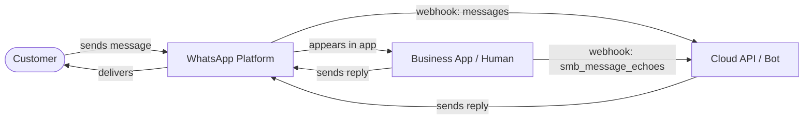
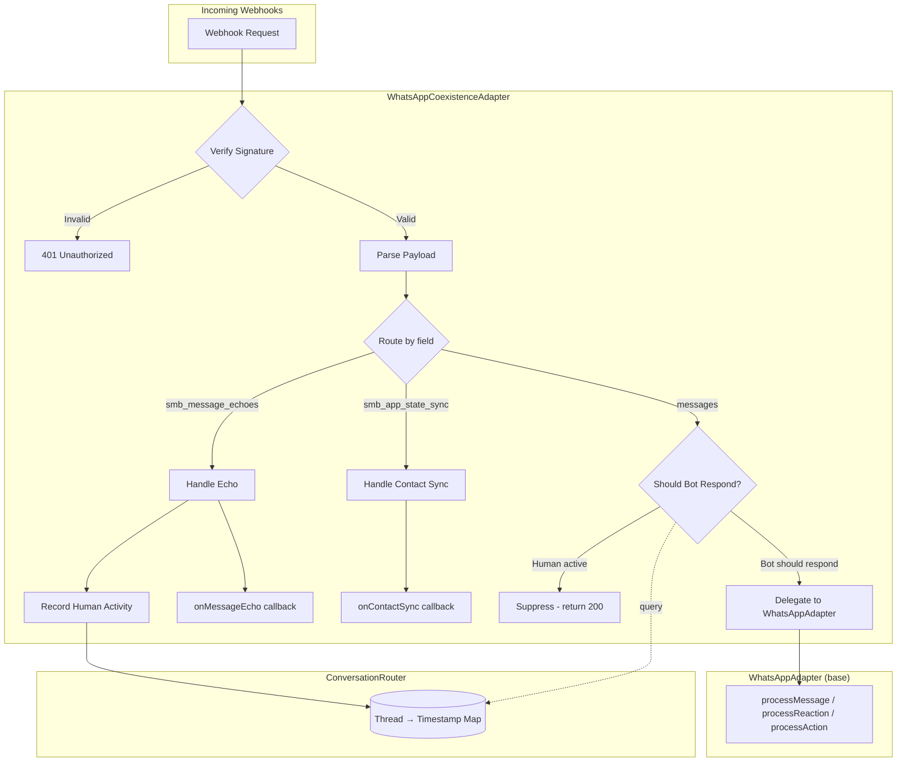
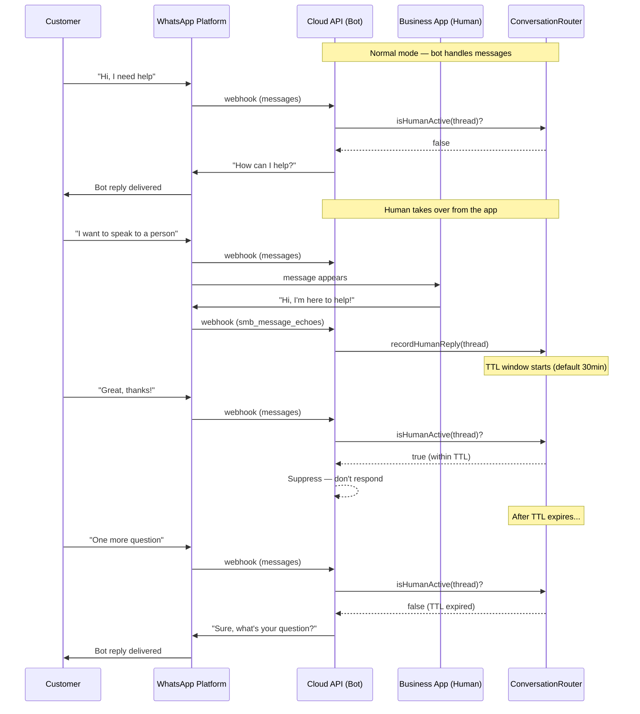
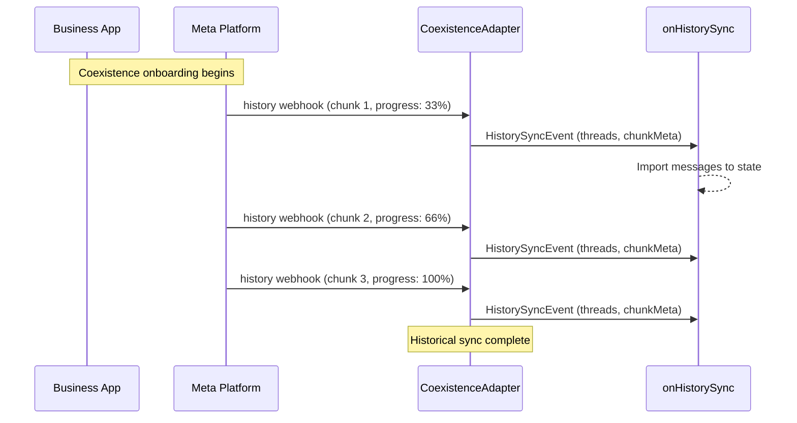
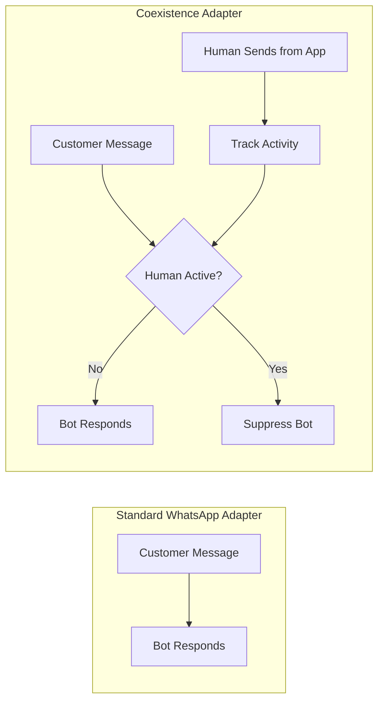

# @chat-adapter/whatsapp-coexistence

WhatsApp Coexistence adapter for the [Vercel Chat SDK](https://github.com/vercel/chat). Enables simultaneous use of the **WhatsApp Business App** (human operator) and the **Cloud API** (bot/automation) on the same phone number.

## How Coexistence Works

WhatsApp coexistence (launched February 2025) allows a single business phone number to be connected to both the WhatsApp Business App and the Cloud API at the same time. Messages from customers arrive on both sides, and either the human or the bot can respond.



The key challenge is **preventing the bot and human from talking over each other**. This adapter solves that with application-level conversation routing.

## Architecture

The adapter wraps the standard `WhatsAppAdapter` (Cloud API only) and intercepts webhooks to handle three new coexistence-specific event types from Meta.



## Conversation Routing Flow

When the human operator replies from the Business App, the bot pauses for a configurable window. This prevents conflicts where both the human and bot respond to the same customer.



## History Sync (Onboarding)

When a phone number is first connected in coexistence mode, up to 6 months of historical messages can be synced from the Business App to the API side.



## Installation

```bash
pnpm add @chat-adapter/whatsapp-coexistence
```

## Quick Start

```typescript
import { Chat } from "chat";
import { createWhatsAppCoexistenceAdapter } from "@chat-adapter/whatsapp-coexistence";
import { MemoryState } from "@chat-adapter/state-memory";

const chat = new Chat({
  userName: "my-bot",
  adapters: {
    whatsapp: createWhatsAppCoexistenceAdapter({
      // Pause bot for 30 minutes after human replies from the app
      humanTakeoverTtlMs: 30 * 60 * 1000,

      // Called when the human sends a message from the Business App
      onMessageEcho: (event) => {
        console.log(`Human replied to ${event.threadId}:`, event.echo.text?.body);
      },

      // Called during onboarding to import historical messages
      onHistorySync: (event) => {
        console.log(`Syncing ${event.threads.length} threads (${event.chunkMeta.progress}%)`);
        for (const thread of event.threads) {
          // Import thread.messages into your state adapter
        }
      },

      // Called when contacts sync from the Business App
      onContactSync: (event) => {
        console.log(`Synced ${event.contacts.length} contacts`);
      },
    }),
  },
  state: new MemoryState(),
});
```

## Configuration

| Option | Type | Default | Description |
|--------|------|---------|-------------|
| `accessToken` | `string` | `env.WHATSAPP_ACCESS_TOKEN` | Cloud API access token |
| `appSecret` | `string` | `env.WHATSAPP_APP_SECRET` | App secret for webhook signature verification |
| `phoneNumberId` | `string` | `env.WHATSAPP_PHONE_NUMBER_ID` | Business phone number ID |
| `verifyToken` | `string` | `env.WHATSAPP_VERIFY_TOKEN` | Webhook verification token |
| `humanTakeoverTtlMs` | `number` | `1800000` (30min) | How long to suppress bot after human replies |
| `onMessageEcho` | `function` | — | Callback for Business App message echoes |
| `onHistorySync` | `function` | — | Callback for historical message import |
| `onContactSync` | `function` | — | Callback for contact sync |
| `shouldBotRespond` | `function` | — | Custom routing function (overrides TTL logic) |

## Custom Routing

For advanced use cases (CRM integration, agent assignment queues, business hours), provide a `shouldBotRespond` function:

```typescript
const adapter = createWhatsAppCoexistenceAdapter({
  shouldBotRespond: async (context) => {
    // Always let bot handle outside business hours
    const hour = new Date().getHours();
    if (hour < 9 || hour >= 17) return true;

    // During business hours, defer to human if they replied recently
    if (context.msSinceHumanReply < 60 * 60 * 1000) return false;

    // Otherwise bot handles it
    return true;
  },
});
```

The `RoutingContext` provides:

| Field | Type | Description |
|-------|------|-------------|
| `threadId` | `string` | Thread ID for the conversation |
| `customerWaId` | `string` | Customer's WhatsApp phone number |
| `phoneNumberId` | `string` | Business phone number ID |
| `lastHumanReplyAt` | `Date \| null` | When the human last replied, or null |
| `msSinceHumanReply` | `number` | Milliseconds since last human reply, or `Infinity` |

## Manual Thread Control

Access the `ConversationRouter` to manually control thread ownership:

```typescript
const adapter = createWhatsAppCoexistenceAdapter({ /* ... */ });
const router = adapter.getRouter();

// Check if human is currently handling a thread
router.isHumanActive(threadId); // boolean

// Release a thread back to the bot (e.g., human clicked "Transfer to bot")
router.releaseThread(threadId);

// Check when human last replied
router.getLastHumanReplyAt(threadId); // Date | null
router.getMsSinceHumanReply(threadId); // number | Infinity
```

## Webhook Setup

Your webhook endpoint needs to handle both standard and coexistence events. Subscribe to these webhook fields in your Meta App Dashboard:

- `messages` (standard — inbound customer messages)
- `smb_message_echoes` (coexistence — echoes from Business App)
- `smb_app_state_sync` (coexistence — contact sync)

```typescript
// Next.js App Router example
import { after } from "next/server";

export async function GET(request: Request) {
  return chat.webhooks.whatsapp(request);
}

export async function POST(request: Request) {
  return chat.webhooks.whatsapp(request, {
    waitUntil: (p) => after(() => p),
  });
}
```

For the `history` webhook (sent to the partner endpoint during onboarding):

```typescript
export async function POST(request: Request) {
  const payload = await request.json();

  if (payload.event === "history") {
    const adapter = chat.adapters.whatsapp as WhatsAppCoexistenceAdapter;
    await adapter.handleHistoryWebhook(payload);
    return new Response("ok", { status: 200 });
  }

  // Handle other partner webhooks...
}
```

## Comparison with Standard Adapter



| Feature | Standard | Coexistence |
|---------|----------|-------------|
| Cloud API messaging | Yes | Yes |
| Business App alongside | No | Yes |
| Message echo detection | No | Yes |
| Conversation routing | No | Yes (TTL + custom) |
| History import | No | Yes |
| Contact sync | No | Yes |
| Manual thread control | No | Yes |

## Limitations

- **In-memory routing state**: The `ConversationRouter` stores state in memory. For multi-instance deployments, you'll need to implement a shared store (Redis, etc.) or use the `shouldBotRespond` callback with your own persistence.
- **No platform-level handoff**: Meta does not provide a built-in conversation ownership API. Routing is entirely application-level.
- **Regional restrictions**: Coexistence is not available in the EU, EEA, UK, or for numbers from certain countries. See [Meta's documentation](https://developers.facebook.com/documentation/business-messaging/whatsapp/embedded-signup/onboarding-business-app-users/) for details.
- **Status webhook reliability**: Some developers report that delivery/read status webhooks may not fire reliably in coexistence mode.

## References

- [Meta: Onboarding Business App Users (Coexistence)](https://developers.facebook.com/documentation/business-messaging/whatsapp/embedded-signup/onboarding-business-app-users/)
- [Meta: smb_message_echoes Webhook](https://developers.facebook.com/documentation/business-messaging/whatsapp/webhooks/reference/smb_message_echoes/)
- [Meta: smb_app_state_sync Webhook](https://developers.facebook.com/documentation/business-messaging/whatsapp/webhooks/reference/smb_app_state_sync/)
- [Meta: Cloud API Webhook Components](https://developers.facebook.com/docs/whatsapp/cloud-api/webhooks/components/)
