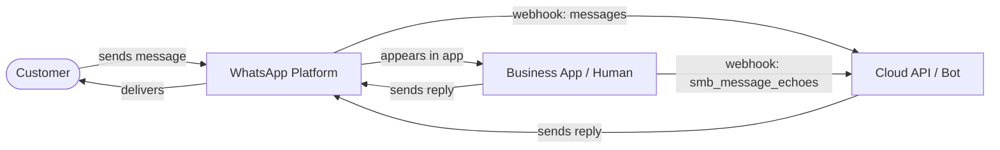
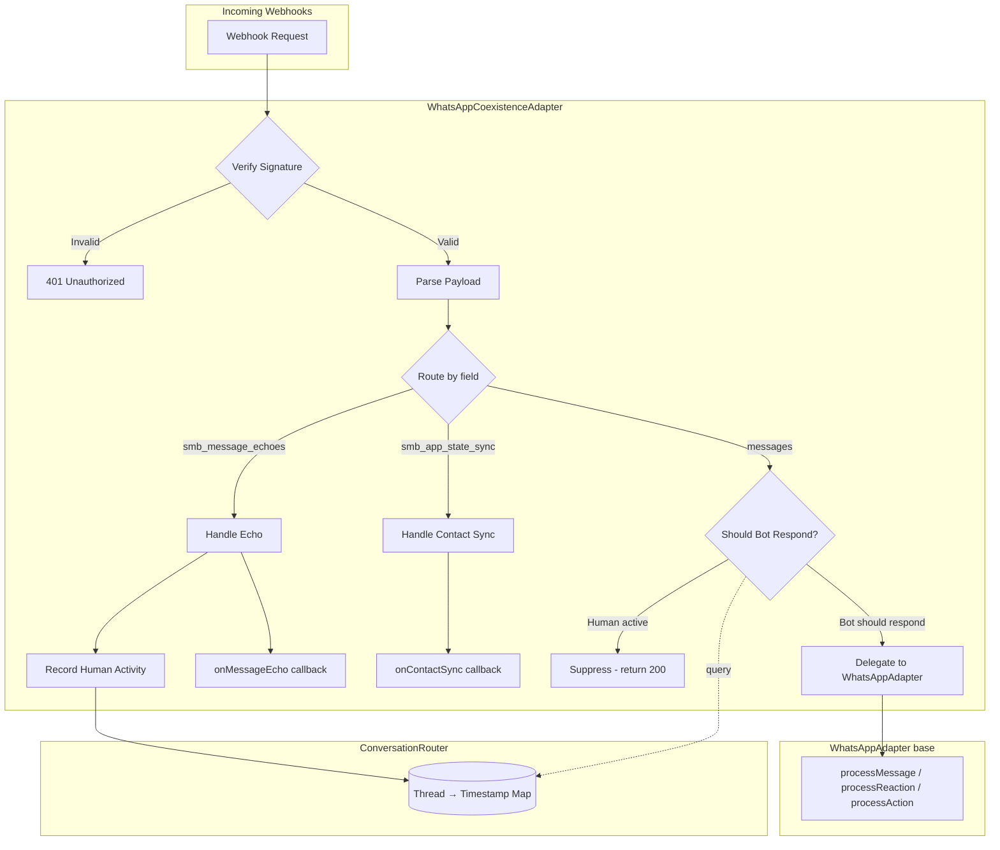
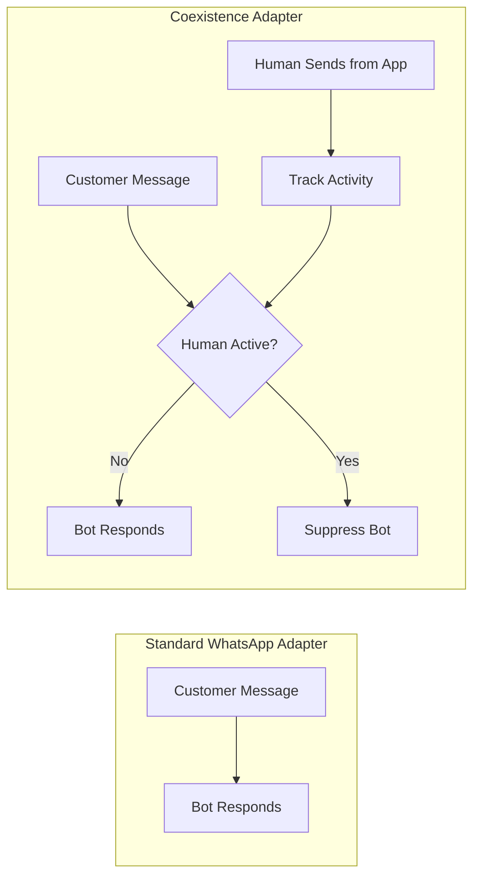

# Architecture

## How Coexistence Works

WhatsApp coexistence (launched February 2025) allows a single business phone number to be connected to both the WhatsApp Business App and the Cloud API at the same time. Messages from customers arrive on both sides, and either the human or the bot can respond.

The key challenge is **preventing the bot and human from talking over each other**. This adapter solves that with application-level conversation routing.

## Adapter Design

The adapter wraps the standard `WhatsAppAdapter` (Cloud API only) using **composition** and intercepts webhooks to handle three new coexistence-specific event types from Meta.

## Why Composition Over Inheritance

The base `WhatsAppAdapter` has many private methods (signature verification, message building, Graph API calls). Rather than duplicating or hacking around that, the coexistence adapter:

- Wraps the base adapter as `inner`
- Intercepts `handleWebhook()` to process coexistence events first
- Delegates all standard operations (send, react, stream, etc.) directly to `inner`
- Only adds new behavior: echo handling, routing, history sync

## Comparison with Standard Adapter

| Feature | Standard | Coexistence |
|---------|----------|-------------|
| Cloud API messaging | Yes | Yes |
| Business App alongside | No | Yes |
| Message echo detection | No | Yes |
| Conversation routing | No | Yes (TTL + custom) |
| History import | No | Yes |
| Contact sync | No | Yes |
| Manual thread control | No | Yes |

## Limitations

- **In-memory routing state**: The `ConversationRouter` stores state in memory. For multi-instance deployments, implement a shared store (Redis, etc.) or use the `shouldBotRespond` callback with your own persistence.
- **No platform-level handoff**: Meta does not provide a built-in conversation ownership API. Routing is entirely application-level.
- **Regional restrictions**: Coexistence is not available in the EU, EEA, UK, or for numbers from certain countries. See [Meta's documentation](https://developers.facebook.com/documentation/business-messaging/whatsapp/embedded-signup/onboarding-business-app-users/) for details.
- **Status webhook reliability**: Some developers report that delivery/read status webhooks may not fire reliably in coexistence mode.
