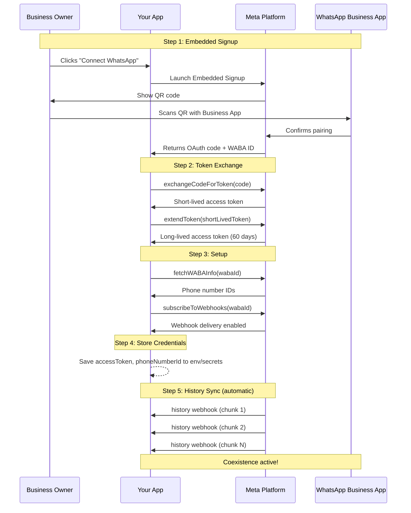
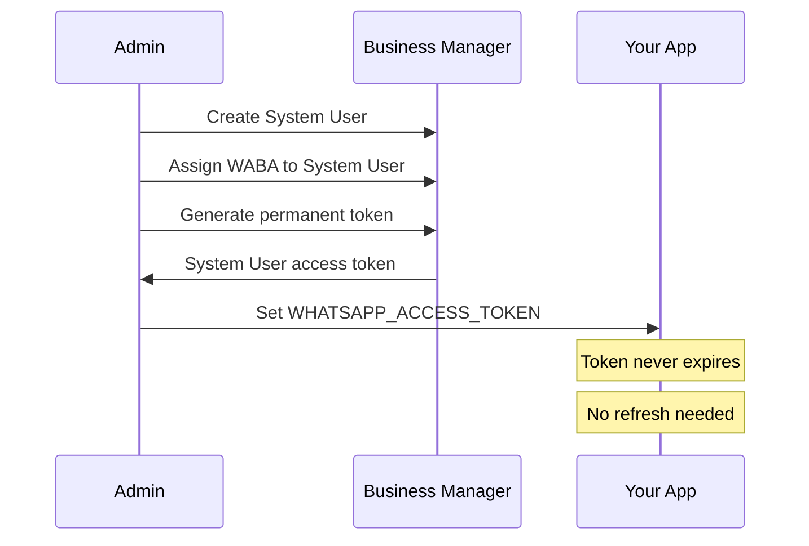
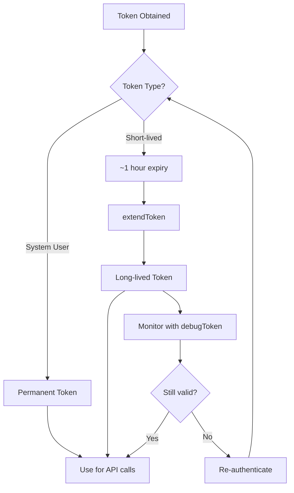

# Authentication & Token Management

## Overview

WhatsApp Cloud API requires several credentials. This document covers what each one is, where to get it, and how the auth utilities help manage the token lifecycle.

## Credentials

| Credential | Env Var | Where to Get It | Purpose |
|-----------|---------|-----------------|---------|
| **App ID** | `FACEBOOK_APP_ID` | App Dashboard → Settings → Basic | Identifies your Meta app |
| **App Secret** | `WHATSAPP_APP_SECRET` | App Dashboard → Settings → Basic | Webhook signature verification + OAuth flows |
| **Access Token** | `WHATSAPP_ACCESS_TOKEN` | Embedded Signup or System User token | Authenticates Cloud API calls |
| **Phone Number ID** | `WHATSAPP_PHONE_NUMBER_ID` | WABA dashboard or `fetchWABAInfo()` | Identifies which business number to use |
| **Verify Token** | `WHATSAPP_VERIFY_TOKEN` | You generate it (`generateVerifyToken()`) | Webhook endpoint verification |

## Auth Flow: Embedded Signup (Coexistence)

For coexistence mode, onboarding uses **Embedded Signup** with a QR code pairing flow. Here's the complete token lifecycle:



## Auth Flow: System User Token (Permanent)

For production, you typically create a **System User** with a permanent token that never expires:



## Token Lifecycle Management



## Usage

### Validate Environment

Check that all required env vars are set before starting your app:

```typescript
import { validateEnv } from "@chat-adapter/whatsapp-coexistence";

const env = validateEnv();
// Throws with a list of missing vars if any are unset
```

### Embedded Signup Callback

Handle the OAuth callback from Embedded Signup:

```typescript
import {
  exchangeCodeForToken,
  extendToken,
  fetchWABAInfo,
  subscribeToWebhooks,
  loadCredentialsFromEnv,
} from "@chat-adapter/whatsapp-coexistence";

export async function handleSignupCallback(code: string, wabaId: string) {
  const credentials = loadCredentialsFromEnv();

  // Exchange OAuth code for short-lived token
  const { accessToken: shortLived } = await exchangeCodeForToken(
    code,
    credentials
  );

  // Extend to long-lived token (60 days)
  const { accessToken, expiresIn } = await extendToken(
    shortLived,
    credentials
  );

  // Discover phone number IDs
  const waba = await fetchWABAInfo(wabaId, accessToken);
  const phoneNumberId = waba.phoneNumbers[0].id;

  // Enable webhook delivery
  await subscribeToWebhooks(wabaId, accessToken);

  // Store these securely (e.g., encrypted in your database)
  return { accessToken, phoneNumberId, expiresIn };
}
```

### Token Health Check

Monitor token validity in a cron job or health check endpoint:

```typescript
import { debugToken, loadCredentialsFromEnv } from "@chat-adapter/whatsapp-coexistence";

export async function checkTokenHealth() {
  const credentials = loadCredentialsFromEnv();
  const token = process.env.WHATSAPP_ACCESS_TOKEN!;

  const debug = await debugToken(token, credentials);

  if (!debug.isValid) {
    console.error("Token invalid:", debug.error?.message);
    // Trigger re-authentication flow
    return { healthy: false, error: debug.error?.message };
  }

  if (debug.expiresAt > 0) {
    const daysLeft = (debug.expiresAt * 1000 - Date.now()) / 86400000;
    if (daysLeft < 7) {
      console.warn(`Token expires in ${Math.round(daysLeft)} days — refresh soon`);
    }
  }

  return { healthy: true, scopes: debug.scopes };
}
```

### Generate Verify Token

Generate a verify token for webhook setup:

```typescript
import { generateVerifyToken } from "@chat-adapter/whatsapp-coexistence";

const verifyToken = generateVerifyToken();
console.log("Set this as WHATSAPP_VERIFY_TOKEN:", verifyToken);
// Also configure it in Meta App Dashboard → Webhooks → Verify Token
```

## Security Notes

- **Never expose `appSecret` in client-side code.** It's a server-side credential only.
- **Store `accessToken` encrypted** in your secrets manager or database, not in plaintext config files.
- **Rotate long-lived tokens** before they expire (60-day window). Set up monitoring with `debugToken()`.
- **System User tokens are preferred** for production — they never expire and aren't tied to a personal account.

## References

- [Meta: Embedded Signup](https://developers.facebook.com/documentation/business-messaging/whatsapp/embedded-signup/)
- [Meta: Onboarding Business App Users](https://developers.facebook.com/documentation/business-messaging/whatsapp/embedded-signup/onboarding-business-app-users/)
- [Meta: Access Token Types](https://developers.facebook.com/docs/facebook-login/guides/access-tokens/)
- [Meta: Debug Token](https://developers.facebook.com/docs/facebook-login/guides/access-tokens/debugging/)
- [Meta: System Users](https://developers.facebook.com/docs/marketing-api/system-users/)
