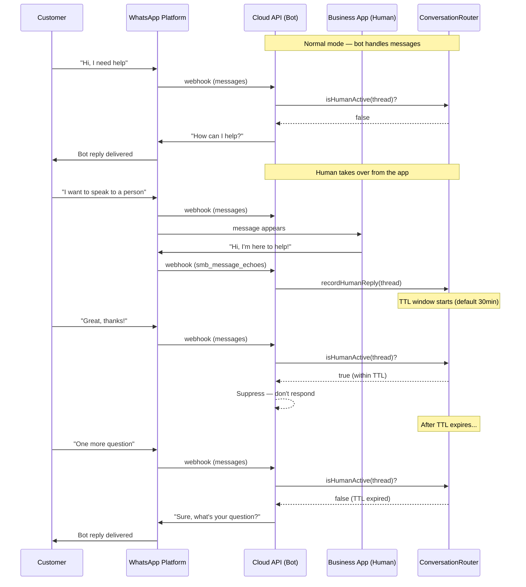

# Conversation Routing

## How Routing Works

When the human operator replies from the Business App, the adapter detects it via `smb_message_echoes` and suppresses bot responses for a configurable time window. This prevents the bot and human from talking over each other.



## Default Routing (TTL-based)

By default, the adapter uses a simple TTL-based approach:

1. When an `smb_message_echoes` event arrives, the thread is marked as "human active"
2. For `humanTakeoverTtlMs` (default 30 minutes), all inbound customer messages on that thread are suppressed — the bot won't process them
3. After the TTL expires, the bot resumes processing

```typescript
const adapter = createWhatsAppCoexistenceAdapter({
  humanTakeoverTtlMs: 30 * 60 * 1000, // 30 minutes
});
```

## Custom Routing

For advanced use cases, provide a `shouldBotRespond` function that overrides the default TTL logic:

```typescript
const adapter = createWhatsAppCoexistenceAdapter({
  shouldBotRespond: async (context) => {
    // Always let bot handle outside business hours
    const hour = new Date().getHours();
    if (hour < 9 || hour >= 17) return true;

    // During business hours, defer to human if they replied recently
    if (context.msSinceHumanReply < 60 * 60 * 1000) return false;

    // Check your CRM for agent assignment
    const agent = await crm.getAssignedAgent(context.customerWaId);
    if (agent) return false;

    // Otherwise bot handles it
    return true;
  },
});
```

### RoutingContext

The `shouldBotRespond` callback receives:

| Field | Type | Description |
|-------|------|-------------|
| `threadId` | `string` | Thread ID for the conversation |
| `customerWaId` | `string` | Customer's WhatsApp phone number |
| `phoneNumberId` | `string` | Business phone number ID |
| `lastHumanReplyAt` | `Date \| null` | When the human last replied, or null |
| `msSinceHumanReply` | `number` | Milliseconds since last human reply, or `Infinity` |

## Manual Thread Control

Access the `ConversationRouter` to manually control thread ownership:

```typescript
const router = adapter.getRouter();

// Check if human is currently handling a thread
router.isHumanActive(threadId); // boolean

// Release a thread back to the bot
// (e.g., human clicked "Transfer to bot" in your CRM)
router.releaseThread(threadId);

// Check when human last replied
router.getLastHumanReplyAt(threadId); // Date | null
router.getMsSinceHumanReply(threadId); // number | Infinity
```

## Multi-Instance Deployments

The default `ConversationRouter` stores state in memory. If you run multiple server instances, human activity recorded on one instance won't be visible to others.

Solutions:

1. **Use `shouldBotRespond` with Redis/database**: Query shared state in your custom routing function
2. **Sticky sessions**: Route all webhooks for a phone number to the same instance
3. **Shared event bus**: Broadcast echo events across instances via Redis pub/sub

```typescript
// Example: Redis-backed routing
import { createClient } from "redis";

const redis = createClient();

const adapter = createWhatsAppCoexistenceAdapter({
  onMessageEcho: async (event) => {
    // Store in Redis with TTL
    await redis.set(
      `human-active:${event.threadId}`,
      Date.now().toString(),
      { EX: 1800 } // 30 minutes
    );
  },

  shouldBotRespond: async (context) => {
    const lastReply = await redis.get(`human-active:${context.threadId}`);
    return lastReply === null; // Bot responds only if human is NOT active
  },
});
```
