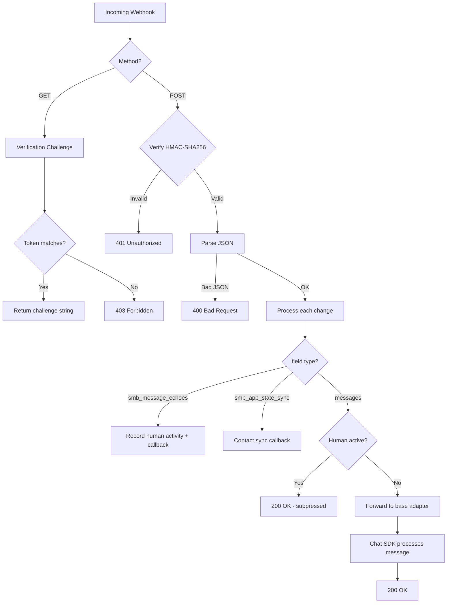
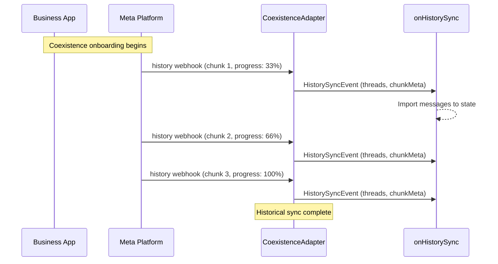

# Webhook Setup

## Required Webhook Subscriptions

Subscribe to these webhook fields in your Meta App Dashboard:

| Field | Standard API | Coexistence | Purpose |
|-------|-------------|-------------|---------|
| `messages` | Required | Required | Inbound customer messages |
| `smb_message_echoes` | N/A | Required | Messages sent from Business App |
| `smb_app_state_sync` | N/A | Required | Contact sync from Business App |

## Webhook Endpoint

The adapter handles both standard and coexistence events through the same `handleWebhook()` endpoint:

```typescript
// Next.js App Router
import { after } from "next/server";

export async function GET(request: Request) {
  return chat.webhooks.whatsapp(request);
}

export async function POST(request: Request) {
  return chat.webhooks.whatsapp(request, {
    waitUntil: (p) => after(() => p),
  });
}
```

## Webhook Flow



## History Sync

During coexistence onboarding, Meta sends historical messages (up to 6 months) to the **partner webhook** endpoint — this is separate from the phone number webhook.



Handle history webhooks separately in your partner webhook endpoint:

```typescript
import type { WhatsAppCoexistenceAdapter } from "@chat-adapter/whatsapp-coexistence";

export async function POST(request: Request) {
  const payload = await request.json();

  if (payload.event === "history") {
    const adapter = chat.adapters.whatsapp as WhatsAppCoexistenceAdapter;
    await adapter.handleHistoryWebhook(payload);
    return new Response("ok", { status: 200 });
  }

  // Handle other partner webhooks...
}
```

## Message Echo Event

When the human sends a message from the Business App, you receive an `smb_message_echoes` webhook. The adapter processes this automatically, but you can hook into it:

```typescript
const adapter = createWhatsAppCoexistenceAdapter({
  onMessageEcho: (event) => {
    console.log(`Human replied in ${event.threadId}`);
    console.log(`Message: ${event.echo.text?.body}`);
    console.log(`To customer: ${event.echo.to}`);

    // Sync to your CRM, update agent dashboard, etc.
  },
});
```

### Echo Payload Structure

The echo has the same structure as an inbound message but with reversed direction:

| Field | Description |
|-------|-------------|
| `from` | Business phone number (the sender) |
| `to` | Customer's WhatsApp ID (the recipient) |
| `id` | Unique message ID |
| `type` | Message type (text, image, document, etc.) |
| `text`, `image`, etc. | Content fields matching the type |

## Contact Sync

When contacts sync from the Business App, use the `onContactSync` callback:

```typescript
const adapter = createWhatsAppCoexistenceAdapter({
  onContactSync: (event) => {
    for (const contact of event.contacts) {
      console.log(`Contact: ${contact.profile.name} (${contact.wa_id})`);
      // Sync to your contact database
    }
  },
});
```

## Signature Verification

All POST webhooks are verified using HMAC-SHA256 with the App Secret (`WHATSAPP_APP_SECRET`). The adapter checks the `X-Hub-Signature-256` header automatically. Invalid signatures are rejected with 401.

## References

- [Meta: Set Up Webhooks](https://developers.facebook.com/docs/whatsapp/cloud-api/guides/set-up-webhooks)
- [Meta: Webhook Components](https://developers.facebook.com/docs/whatsapp/cloud-api/webhooks/components/)
- [Meta: smb_message_echoes Reference](https://developers.facebook.com/documentation/business-messaging/whatsapp/webhooks/reference/smb_message_echoes/)
- [Meta: smb_app_state_sync Reference](https://developers.facebook.com/documentation/business-messaging/whatsapp/webhooks/reference/smb_app_state_sync/)
